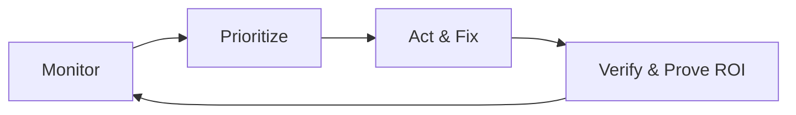

# QueryFit — Complete Product & Design Specification

**Purpose of this document:** Canonical handoff for **Google AI Studio** (or any design/regeneration tool) to redesign QueryFit while preserving product intent, information architecture, and business logic. Treat this as the single source of truth.

**Version:** 2.0 (Redesign Brief)  
**Live app:** https://queryfit-ai-visibility-optimizer.vercel.app  
**Stack:** React 19, TypeScript, Vite, Tailwind CSS (CDN), Recharts, Lucide icons  
**Default theme:** Dark mode (“Deep Amethyst”) with light mode toggle

---

## Table of Contents

1. [Executive Summary](#1-executive-summary)
2. [Target Users & Jobs to Be Done](#2-target-users--jobs-to-be-done)
3. [Product Positioning](#3-product-positioning)
4. [Core Concepts & Metrics](#4-core-concepts--metrics)
5. [Complete Information Architecture](#5-complete-information-architecture)
6. [Global Shell & Navigation](#6-global-shell--navigation)
7. [Page-by-Page Specification](#7-page-by-page-specification)
8. [Modals, Drawers & Overlays](#8-modals-drawers--overlays)
9. [Design System (Current)](#9-design-system-current)
10. [Signature UI Components](#10-signature-ui-components)
11. [Data Model Reference](#11-data-model-reference)
12. [Business Logic & Scoring](#12-business-logic--scoring)
13. [Integrations](#13-integrations)
14. [Monetization & Feature Gating](#14-monetization--feature-gating)
15. [User Flows (End-to-End)](#15-user-flows-end-to-end)
16. [Redesign Brief for AI Studio](#16-redesign-brief-for-ai-studio)
17. [Technical Constraints to Preserve](#17-technical-constraints-to-preserve)
18. [File & Module Map](#18-file--module-map)

---

## 1. Executive Summary

**QueryFit** is a B2B SaaS platform for **AI Visibility Optimization (AIVO)**.

As search shifts from traditional engines (Google, Bing) to **Generative AI Answer Engines** (ChatGPT, Claude, Gemini, Perplexity, Copilot), brands lose visibility into how they are cited, ranked, and described. QueryFit tracks **questions and answers**—not just keywords—and measures **Share of Voice** inside LLM-generated responses.

**One-line pitch:** *“The command center for winning in AI search.”*

**What makes it different from SEO tools:**
| Traditional SEO | QueryFit |
|-----------------|----------|
| Keywords & backlinks | Tracked **questions** (prompts users ask AI) |
| SERP positions | **Mention rate**, **citation links**, **sentiment**, **list position** in AI answers |
| Domain authority | **Visibility Index** per query × engine |
| Technical audits only | Closes the loop: diagnose → task → fix → **re-scan to verify** |

---

## 2. Target Users & Jobs to Be Done

### Primary personas

| Persona | Goal | Pain |
|---------|------|------|
| **Marketing lead / CMO** | Prove AI visibility ROI to leadership | No dashboard for “how ChatGPT talks about us” |
| **SEO / growth manager** | Prioritize fixes with highest lift | Too many metrics, unclear next action |
| **Agency account manager** | Manage multiple clients, white-label reports | Needs workspace isolation + client-ready UI |
| **Content strategist** | Align pages with what AI models cite | Doesn’t know which pages/domains AI trusts |

### Jobs to be done (JTBD)

1. **“Am I winning or losing today?”** → Mission Control / Dashboard  
2. **“Which questions matter most?”** → Tracked Queries  
3. **“What should I fix first?”** → Strategy / To-Do, Easy SEO Wins  
4. **“Where are new opportunities?”** → New Topic Ideas (Opportunity Feed)  
5. **“Who is beating me and why?”** → Competitors, Citation Leaderboards  
6. **“Did my fix work?”** → Re-scan + Traffic Results (GSC/GA4 snapshots)  
7. **“Can I afford the next scan?”** → Credits HUD, confirmation modals  

**Accessibility principle:** Non-technical users must understand metrics via **plain English**, `InfoTooltip` copy, and visual gaps (You vs. Leader bars)—not raw API jargon.

---

## 3. Product Positioning

### Category
AI Visibility Management / Generative Search Optimization (GEO/AEO adjacent).

### Competitive framing (for copy & design)
- Not a keyword research tool.
- Not a generic project manager.
- **Intelligence platform** that combines monitoring, competitive benchmarking, organic search (GSC), on-page performance (CWV), and influencer discovery (YouTube).

### Brand personality (current)
- **Premium B2B SaaS** — dark, confident, data-dense  
- **AI-native** — violet/amethyst accents, glow, glass surfaces  
- **Action-oriented** — every insight should suggest a next step  

---

## 4. Core Concepts & Metrics

### A. Visibility Index (0–100)
Central KPI aggregating performance across tracked queries and enabled AI engines.

**Component weights (marketing / overview copy):**
| Component | Weight | Meaning |
|-----------|--------|---------|
| Mention rate | 40% | Brand appears in the AI answer |
| Citation authority | 40% | AI provides a clickable source link to the brand |
| Sentiment & tone | 10% | Positive / neutral / negative description |
| Positioning | 10% | Rank in list-style answers (“Top 10 CRMs”) |

**Engine-level formula (implementation v1):**
```
Score = (Mention × 40) + (Citation × 40) + (Top-3 position × 20)
```

### B. Tracked Question (Query)
The **atomic unit** of the product. Each row = one high-intent question (e.g., “Best CRM for startups”) tracked per **market** (region + language).

Per query the UI shows:
- Overall score + per-engine scores (ChatGPT, Claude, Gemini, Perplexity, Copilot)
- **Leader name** + **leader score** + competitive gap bar (You vs. Leader)
- Citations count + citation leaderboard (which domains AI cites)
- Volatility label: Stable / Changing / Unstable
- Next best action (effort + impact)
- Engine health (ok / missing_key / error)

### C. Credit economy
Consumption-based scanning:
- **1 scan ≈ 5 credits per engine** (shown in `CreditConfirmationModal` before confirm)
- **Managed mode:** platform runs scans (no user API keys)
- **Direct mode (BYOAK):** enterprise brings own API keys; reduces credit cost
- **Auto-refill** optional when balance low
- Credits HUD always visible in sidebar footer

### D. Workspace & agency model
- **Workspace:** isolated client environment (name, industry, timezone, domains, credits)
- **Multiple domains** per workspace with primary domain flag
- **Plan tiers:** Starter, Pro, Agency — gate engines, workspaces, heatmaps, white-label
- **Automation:** scheduled scans (Daily / Weekly / Monthly) with strategy (all / high priority / rotation)

### E. Supported AI engines
| Engine | Enum |
|--------|------|
| ChatGPT | `CHATGPT` |
| Claude | `CLAUDE` |
| Gemini | `GEMINI` |
| Perplexity | `PERPLEXITY` |
| Copilot | `COPILOT` |

---

## 5. Complete Information Architecture

### Primary navigation (sidebar — 4 groups)

```
MONITORING
├── Dashboard          → overview
├── Tracked Queries    → queries (+ count badge)
└── Competitors        → competitor-hub

ACTION PLAN
├── To-Do List         → strategy
├── Easy SEO Wins      → ai-recs (GSC recommendations)
├── Website Speed      → performance (Core Web Vitals)
├── SEO Tests          → experiments (GSC A/B)
└── Auto-Scan          → automation

GROWTH & TRAFFIC
├── New Topic Ideas    → suggested (+ count badge)
├── Organic Search     → seo-heatmap (GSC opportunities)
├── Find Influencers   → creators-youtube
└── User Behavior      → heatmaps (Agency tier only — locked otherwise)

RESULTS
├── Traffic Results    → results (ROI / snapshots)
└── Connections        → integrations (GSC, GA4, YouTube, Clarity)
```

### Secondary routes (not in sidebar — reachable via header, drill-down, or deep links)

| Route key | Page | Access |
|-----------|------|--------|
| `query-detail` | Query deep dive | Click row in Queries / Dashboard |
| `competitor-detail` | Competitor deep dive | Click rival in hub / widgets |
| `settings` | Account & workspace config | User menu, workspace menu |
| `billing` | Plans & credits | Sidebar “Top Up”, user menu |
| `alerts` | Notifications list | Header bell icon |
| `reports` | Report generation | Legacy / future — exists in router |

### Mental model for redesign
Organize IA around **three loops**:



---

## 6. Global Shell & Navigation

### Layout structure
```
┌─────────────┬──────────────────────────────────────────────────┐
│  Sidebar    │  Header (h-20): workspace, domain, tools, user  │
│  w-64       ├──────────────────────────────────────────────────┤
│             │  Main content (scrollable, full width)           │
│  Logo       │  page-transition animation on route change       │
│  Nav groups │                                                  │
│  Credits    │                                                  │
└─────────────┴──────────────────────────────────────────────────┘
```

### Header elements (left → right)
1. **Workspace switcher** — avatar letter, workspace name, active domain URL; dropdown: switch domain, add domain, manage domains, new workspace  
2. **Automation toggle** — “Auto” switch; opens `AutomationControlModal` when enabling  
3. **Theme toggle** — dark / light (`Sun` / `Moon`)  
4. **Global search** — `Ctrl+K` / `Cmd+K` → `GlobalSearchModal` (queries, competitors, tasks)  
5. **Notifications** — bell → Alerts page; red dot indicator  
6. **User menu** — profile, subscription, sign out  

### Toast system
Bottom-right stack; types: success, info, warning, error; optional action button.

### Routing
State-based (`activePage` in `App.tsx`) — **no React Router**. Redesign may introduce URL routes but must map 1:1 to existing page keys for parity.

---

## 7. Page-by-Page Specification

### 7.1 Dashboard — `overview` (`pages/Overview.tsx`)
**User question:** *“Am I winning? What’s urgent? What do I do next?”*

**Layout:** 12-column grid, full-width, no max-width container.

| Zone | Component | Content |
|------|-----------|---------|
| Hero | `MissionHero` | Visibility Index (large), 7/28/90d trend chart, market leader gap, scan CTA |
| Risk | `GeoAlertsSection` | Max 5 scan-based alerts (tone shift, misinformation, citation loss, crawl issue, competitor gained) |
| Row | `TrackedQuestionsWidget` | Top queries with You vs. Leader bars |
| Row | `TopMoversWidget` | Top gains / top drops tabs |
| Row | `OpportunitiesWidget` | Suggested queries with surge % |
| Row | `NextBestActionsWidget` | High-impact tasks from Strategy |
| Row | `TopRivalsWidget` | Global leaders vs. my rivals |
| Feed | `PulseFeed` | Scan activity log (not real-time) |

**Primary actions:** Scan workspace (credit confirm), Add question, Add competitor, time range toggle.

---

### 7.2 Tracked Queries — `queries` (`pages/Queries.tsx`)
**User question:** *“How am I performing on each question, per engine and vs. rivals?”*

**UI pattern:** High-density data table.

| Column concept | Purpose |
|--------------|---------|
| Question + market flag | Context (region, language) |
| Priority badge | High / Medium / Low triage |
| Engine dots | Health across 5 engines |
| Scoring ring | 0–100 at a glance |
| Competitive gap | Dual progress bar: You vs. Leader; Trailing (rose) / Leading (teal) |
| Citations | Count; opens `CitationLeaderboardModal` |
| Fix next | Routes to query detail with recommended action |
| Zap | Per-row rescan |

**Filters:** Losing, No citations, Errors, Unstable.  
**Bulk:** Scan all (with credit modal).

---

### 7.3 Query Detail — `query-detail` (`pages/QueryDetail.tsx`)
**User question:** *“Why is this score low, and how do I fix this specific question?”*

**Sections (typical):**
- Header: question text, market, priority, overall ring + engine breakdown  
- Historical trend charts  
- Per-engine perception snippets (sentiment + short quote)  
- Competitive comparison vs. leader  
- Content Intelligence card + `CoreWebVitalsStrip`  
- Content audit checklist → `ContentAuditModal`  
- Related tasks / recommendations  
- Citations modal, evidence drawer, fix variants  

**Deep-link actions:** `initialAction` can open audit, scan, or fix flow directly.

---

### 7.4 New Topic Ideas — `suggested` (`pages/Suggested.tsx`)
**User question:** *“What questions should I start tracking that I’m missing?”*

**Layout:** Split view — left scrollable feed, right 500px intelligence panel (slide-in).

**Card data:** Surge %, tags, ROI potential, rival gap, AI-generated reason.  
**CTA:** Capture opportunity → moves to Tracked Queries + baseline scan (5 credits).

**Empty state:** Ghost icon — “you’re up to date.”

---

### 7.5 To-Do List (Strategy) — `strategy` (`pages/Strategy.tsx`)
**User question:** *“What fixes should my team execute, in what order?”*

**Layout:** Kanban — Todo | Doing | Done (or list toggle).

**Task card:** Title, impact (S/M/L), effort (S/M/L), linked query, steps checklist.  
**Fix drawer:** AI-generated HTML/copy snippet, step-by-step checklist, impact explanation.  
**Verify:** Mark done → trigger single-query re-scan (credits).

**Filters:** High impact, Quick wins.

---

### 7.6 Competitors — `competitor-hub` + `competitor-detail`
**Hub** (`pages/CompetitorHub.tsx`): Grid/list of tracked rivals + suggested rivals.  
**Detail** (`pages/CompetitorDetail.tsx`): Visibility trend, shared queries, citation leaderboard, backlinks, gap analysis, audience overlap modal.

**Views:** Rankings comparison, citation sources, query overlap.

---

### 7.7 Easy SEO Wins — `ai-recs` (`pages/GscRecommendationsPage.tsx`)
**Requires:** GSC connected.

**Card feed** of rule-based recommendations from `gscRecommendationEngine.ts`:
| Trigger | Action type |
|---------|-------------|
| LOW_CTR | Title & meta optimization |
| QUICK_WIN | Content update |
| RISING | Content expansion |
| MISMATCH | Intent / canonical fix |

Each card: Why, evidence metrics, priority score, steps, “Generate variants” → `GscVariantGenModal`, “Create task” → Strategy.

---

### 7.8 SEO Tests — `experiments` (`pages/GscExperimentsPage.tsx`)
**Scientific loop:** Deploy change → baseline GSC snapshot → measuring → winner/no change after 7/14/28 days.

**UI:** Active experiments with CTR/click deltas vs. baseline.

---

### 7.9 Organic Search — `seo-heatmap` (`pages/SeoOpportunityHeatmapPage.tsx`)
**GSC opportunity heatmap** — four opportunity types:

| Type | Meaning |
|------|---------|
| LOW_CTR | High impressions, low clicks — fix title/meta |
| QUICK_WIN | Position 4–15 — content boost |
| MISMATCH | Wrong page ranking vs. `targetUrl` |
| RISING | Momentum query — expand content |

**UI:** Connection card (`GscConnectCard` / wizard), summary tiles, table + `OpportunityDrawer`.

---

### 7.10 Website Speed — `performance` (`pages/PerformancePage.tsx`)
**Core Web Vitals** at scale:
- **LCP** < 2.5s (load)
- **INP** < 200ms (responsiveness)
- **CLS** < 0.1 (stability)

Trend charts 90d, top failing pages list, mobile vs. desktop.

---

### 7.11 Auto-Scan — `automation` (`pages/Automation.tsx`)
Schedule configuration: frequency, start time, scan strategy. Tied to header Auto toggle.

---

### 7.12 Find Influencers — `creators-youtube` (`pages/CreatorsYouTube.tsx`)
**BYOK:** User supplies YouTube Data API key.

**Features:** Channel search with presets (Micro/Mid/Macro/Mega), geography, Fit Score 0–100, grid/table view, influencer report overlay, shortlist, CSV export, `AudienceOverlapModal`.

---

### 7.13 User Behavior — `heatmaps` (`pages/HeatmapsPage.tsx`)
**Agency tier only.** Microsoft Clarity BYOK — embed iframe + deep links (`ClaritySetupWizard`, `ClarityEmbedFrame`).

---

### 7.14 Traffic Results — `results` (`pages/Results.tsx`)
**Traffic Proof / ROI:** Compare baseline vs. latest snapshots (GSC clicks/impressions, GA4 sessions) linked to strategy tasks.

---

### 7.15 Connections — `integrations` (`pages/Integrations.tsx`)
**Integration hub:**
| Service | Status | Purpose |
|---------|--------|---------|
| Google Search Console | connected/disconnected | SEO heatmap, recommendations, experiments, ROI |
| GA4 | connected/disconnected | Traffic proof |
| YouTube | API key | Creator finder |
| Microsoft Clarity | project ID | Heatmaps |

---

### 7.16 Settings — `settings` (`pages/Settings.tsx`)
**Tabs:**
| Tab ID | Label | Content |
|--------|-------|---------|
| `workspace` | Workspace Info | Name, industry, timezone |
| `engines` | AI Connection | Managed vs. direct mode, API keys per engine |
| `domains` | Tracked Domains | Add/remove URLs |
| `markets` | Markets & Localization | Regions/languages tracked |
| `team` | Team & Access | Seats, roles (UI present) |
| `notifications` | Alert Rules | Custom alert configuration |

---

### 7.17 Billing — `billing` (`pages/Billing.tsx`)
**Plans:** Starter $99, Pro $249, Agency $499 (feature gates in copy).  
**Credit packs:** Purchase with confirmation modals.  
**Usage history** and plan upgrade flows.

---

### 7.18 Alerts — `alerts` (`pages/Alerts.tsx`)
Notification center for geo alerts, scan failures, credit warnings.

---

### 7.19 Reports — `reports` (`pages/Reports.tsx`)
PDF/email digest configuration (stakeholder reporting) — present in router.

---

## 8. Modals, Drawers & Overlays

| Component | Trigger | Purpose |
|-----------|---------|---------|
| `AddQueryModal` | Add question | Create tracked query |
| `AddCompetitorModal` | Add rival | Track competitor |
| `AddDomainModal` | Workspace menu | New domain URL |
| `CreateWorkspaceModal` | New workspace | Agency multi-client |
| `CreditConfirmationModal` | Scan / track | Show credit cost before confirm |
| `AutomationControlModal` | Enable auto-scan | Schedule settings |
| `GlobalSearchModal` | Ctrl+K | Jump to query/competitor/task |
| `CitationLeaderboardModal` | Citations cell | Domains AI cites for leader |
| `CitationsModal` | Query detail | Full citation breakdown |
| `ContentAuditModal` | Audit CTA | On-page checklist |
| `DiscoveryIntelligenceModal` | Dashboard | Opportunity deep dive |
| `EvidenceDrawer` | Alerts / scans | Proof snippets |
| `GscSetupWizard` | GSC connect | OAuth / property selection |
| `GscVariantGenModal` | SEO rec card | 3 title/meta AI variants |
| `OpportunityDrawer` | SEO heatmap row | Opportunity detail |
| `OutreachListModal` | Creators | Influencer outreach list |
| `AudienceOverlapModal` | Creators | Audience overlap report |
| `ManageQueryModal` | Query actions | Edit/pause query |
| `TechnicalFixModal` | Performance | Engineering fix details |
| `PasteHtmlFallbackModal` | Content fix | Paste HTML when fetch fails |
| `FixVariantsPopover` | Task fix | Multiple fix variants |
| `PurchaseConfirmationModal` | Billing | Confirm credit purchase |
| `PlanUpgradeConfirmationModal` | Billing | Confirm tier upgrade |
| `CustomizeAlertRulesModal` | Settings | Alert rule editor |

**Interaction patterns to preserve:**
- Confirm before spending credits  
- Slide-over drawers for detail (not full page reload)  
- Tooltips on every non-obvious metric  

---

## 9. Design System (Current)

### 9.1 Color tokens (Tailwind + CSS variables)

**Primary (AI / brand):**
- `primary-400`: `#a78bfa`
- `primary-500`: `#8b5cf6`
- `primary-600`: `#7c3aed`

**Semantic:**
- **Emerald** `#10b981` — growth, leading, success, pass  
- **Rose** `#ef4444` — trailing, alerts, danger  
- **Amber** `#f59e0b` — warnings, credits, opportunities  

**Surfaces (dark mode HSL variables in `index.html`):**
```css
--background: 240 10% 3.9%    /* ~#0a0a0a */
--foreground: 0 0% 98%
--card: 240 10% 5.5%
--border: 240 5% 12%
--muted: 240 5% 8%
--muted-foreground: 240 5% 65%
```

**Light mode:** inverted neutrals on `:root` (background 98% lightness).

### 9.2 Typography
- **Sans:** Inter (400–900) — UI, headings, tables  
- **Mono:** JetBrains Mono — code snippets, metrics  
- **Label style:** `text-[10px] font-black uppercase tracking-widest` (very common for section labels)  
- **Headings:** `font-black tracking-tighter` for brand moments  

### 9.3 Effects & atmosphere
- `.bg-aurora` — radial violet gradients on hero sections  
- `shadow-glow` — `0 0 20px -5px rgba(167, 139, 250, 0.3)`  
- `backdrop-blur-md`, `bg-card/30`, `border-white/10` on dropdowns  
- Dropdown panels: `bg-[#09090b]`, `rounded-3xl`, heavy shadow  
- Page enter: `fadeIn` 0.4s translateY(4px)  

### 9.4 Spacing & density
- Sidebar: `w-64`, logo area `p-8`  
- Header: `h-20`, `px-8`  
- Cards: `rounded-2xl` / `rounded-3xl` for premium feel  
- Tables: compact rows, inline badges, minimal padding waste  
- **Philosophy:** maximize data per viewport (analyst persona)  

### 9.5 Iconography
- **Lucide React** throughout  
- Engine-specific colors in `constants.tsx` (`ENGINE_METADATA`)  

### 9.6 Charts
- **Recharts:** area (trends), line (competitors), bar (market share)  
- Muted grid lines, gradient fills on area charts  

---

## 10. Signature UI Components

### ScoringRing (`components/ScoringRing.tsx`)
- SVG circular progress, 0–100  
- Optional segmented inner ring per engine  
- Color thresholds: ≥80 emerald, ≥60 amber, ≥40 orange, else red  
- Used in dashboard hero, query table, detail headers  

### InfoTooltip (`components/InfoTooltip.tsx`)
- Sentence-case explanations for non-technical users  
- High z-index; wraps icon buttons and column headers  

### Competitive gap bar
- Background track = leader score  
- Foreground fill = user score  
- Text: “Trailing by X%” (rose) or “Leading by X%” (teal)  

### NavItem (sidebar)
- Active: `bg-primary-500/10 text-primary-400 border border-primary-500/10`  
- Count badges on Tracked Queries & New Topic Ideas  
- Lock icon when feature gated (Heatmaps)  

### CoreWebVitalsStrip
- LCP / INP / CLS pills with pass/fail vs. Google thresholds  
- Mobile + Desktop toggle  

---

## 11. Data Model Reference

**Canonical file:** `types.ts`

### Core entities

```typescript
// Plans & engines
enum PlanTier { STARTER, PRO, AGENCY }
enum Engine { CHATGPT, CLAUDE, GEMINI, PERPLEXITY, COPILOT }
enum QueryStatus { TRACKED, SUGGESTED, SNOOZED, DISMISSED }
enum Priority { LOW, MEDIUM, HIGH }

// Workspace
interface Workspace {
  id, name, industry, timezone, plan_tier,
  domains: Domain[], credits_balance, credits_limit,
  default_market, tracked_markets, enabled_engines,
  automationEnabled, automationSettings, autoRefill,
  claritySettings?
}

// Query (Tracked Question)
interface Query {
  id, text, market, status, priority, tags,
  overall_score, engine_scores, engine_perceptions,
  competitor_engine_scores, delta_7d, lastScannedAt,
  citations, citationLeaderboard, leaderScore, leaderName,
  reasonSummary, nextBestAction, volatilityLabel,
  blindSpotBadges, solutions?
}

// Task (Strategy item)
interface Task {
  id, query_id, title, steps[], impact, effort,
  status: 'todo' | 'doing' | 'done',
  generatedFixContent?, baselineSnapshotId?, latestSnapshotId?
}

// Competitor, Metrics, GeoAlert, Recommendation, MetricsSnapshot...
```

**Specialized type files:**
- `gscTypes.ts`, `clarityTypes.ts`, `types/performanceTypes.ts`, `types/gscRecommendationsTypes.ts`, `types/contentFixTypes.ts`, `types/trafficProofTypes.ts`

---

## 12. Business Logic & Scoring

| Logic | Location |
|-------|----------|
| Mock backend / credits | `services/mockDataService.ts` |
| Engine scanning | `services/engineAdapter.ts` |
| SEO opportunity classification | `services/seoOpportunityEngine.ts` |
| GSC recommendations | `services/gscRecommendationEngine.ts` |
| Content fixes | `services/fixGenerator.ts` |
| YouTube / influencers | `services/youtubeService.ts` |
| Global state & actions | `context/WorkspaceContext.tsx` |

**Volatility:** variance of scores over 7 days.  
**Opportunity score:** competitor cited, user absent or mention-only.  
**Geo alerts:** derived from scan diffs (not real-time webhooks in mock).

---

## 13. Integrations

| Integration | BYOK / OAuth | Features enabled |
|-------------|--------------|------------------|
| **Google Search Console** | OAuth (client-side mock) | Heatmap, recommendations, experiments, ROI charts |
| **GA4** | OAuth mock | Traffic proof snapshots |
| **YouTube Data API** | API key in settings | Creator finder |
| **Microsoft Clarity** | Project ID | Heatmap embed (Agency) |
| **5× LLM APIs** | Managed or BYOAK | Core visibility scans |

**Deep link helpers:** `GscDeepLinks.ts`, `ClarityDeepLinks.ts`

---

## 14. Monetization & Feature Gating

| Tier | Price | Gates |
|------|-------|-------|
| **Starter** | $99/mo | 1 workspace, ~50 queries, 2 engines |
| **Pro** | $249/mo | 5 workspaces, 200 queries, all engines, 5 seats |
| **Agency** | $499/mo | Unlimited workspaces, white-label, API, BYOAK, **Heatmaps** |

**Credit costs:** surfaced before every scan; sidebar balance always visible.  
**Locked UI:** Heatmaps nav item shows lock icon unless `plan_tier === AGENCY`.

---

## 15. User Flows (End-to-End)

### Flow A: First-time value (happy path)
1. Land on Dashboard → see Visibility Index  
2. Review Tracked Questions widget → open weakest query  
3. Read “reason summary” → open Strategy task  
4. Copy AI fix → implement on site  
5. Verify with re-scan → see score increase  
6. Check Traffic Results after GSC connected  

### Flow B: Expansion
1. Open New Topic Ideas → select high-surge card  
2. Capture opportunity (credits) → appears in Tracked Queries  
3. Run competitive gap analysis → add competitor from hub  

### Flow C: Organic + AI combined
1. Connect GSC in Connections  
2. Review Organic Search heatmap → pick LOW_CTR row  
3. Open Easy SEO Wins → generate title variants  
4. Deploy SEO Test experiment → monitor in SEO Tests  

### Flow D: Agency client workflow
1. Create workspace per client  
2. Switch workspace in header  
3. Export influencer CSV / white-label report  
4. Use Heatmaps (Clarity) for CRO evidence  

---

## 16. Redesign Brief for AI Studio

### What to redesign
**Visual design, layout rhythm, component styling, and micro-interactions** — while keeping the information architecture and feature set above.

### Design goals (recommended)
1. **Clarity over density** — reduce cognitive load without removing data; use hierarchy, tabs, and progressive disclosure.  
2. **Unify the “three loops”** — Monitor / Act / Prove should be obvious in nav or page structure.  
3. **Distinct module identity** — Monitoring (cool neutral), Growth (warm accent), Results (green ROI) without breaking brand.  
4. **Accessible contrast** — WCAG AA for `muted-foreground` on dark backgrounds.  
5. **Mobile/tablet** — current layout is desktop-first; define breakpoints for sidebar → drawer.  
6. **Light mode parity** — not an afterthought; test cards and dropdowns in both themes.  

### Keep (brand equity)
- **Scoring Ring** as hero visualization  
- **You vs. Leader** competitive gap pattern  
- **Credit confirmation** before destructive/expensive actions  
- **Violet AI** accent — but consider reducing gradient noise if cleaner look desired  

### Improve (known friction)
- Too many `text-[10px] uppercase` labels — consolidate to a type scale  
- Duplicate navigation paths (settings in 3 places)  
- Table density overwhelming on laptop screens  
- Inconsistent border radius (`xl` vs `2xl` vs `3xl`)  
- Tailwind via CDN — redesign should still map to utility classes or design tokens  

### Deliverables expected from AI Studio
1. Full app shell (sidebar + header)  
2. Dashboard / Mission Control  
3. Tracked Queries table + Query Detail  
4. Strategy Kanban  
5. Opportunity Feed split view  
6. One integration page (Connections)  
7. Design tokens page (colors, type, spacing, components)  

### Sample prompt for AI Studio
```
Redesign QueryFit, a B2B AI Visibility SaaS (see attached QUERYFIT_APP_DOCUMENTATION.md).
Dark-first, premium, data-dense. Preserve: Visibility Index ring, You-vs-Leader bars,
credit confirmations, 5 AI engines, sidebar IA groups. Improve: visual hierarchy,
accessibility, mobile nav, lighter glass effects. Output: React + Tailwind components
matching the page list in Section 7.
```

---

## 17. Technical Constraints to Preserve

| Constraint | Reason |
|------------|--------|
| React 19 + TypeScript | Current codebase |
| `WorkspaceContext` as state hub | All pages consume shared data |
| `types.ts` entity shapes | Mock service + UI depend on them |
| Page keys in `App.tsx` switch | Routing compatibility |
| `mockDataService` | Frontend-only demo; no backend yet |
| `GEMINI_API_KEY` env | AI variant generation in Vite build |
| Credit deduction UX | Core business model |
| Engine enum (5 engines) | Scoring matrix columns |

**Do not remove:** workspace switcher, credits footer, competitive gap visualization, or scan confirmation modals.

---

## 18. File & Module Map

```
/
├── App.tsx                 # Shell, routing, header, modals
├── index.tsx               # React mount
├── index.html              # Tailwind config, CSS variables, fonts
├── types.ts                # Core data model
├── constants.tsx           # Engine metadata, labels
│
├── context/
│   └── WorkspaceContext.tsx
│
├── pages/                  # One file per main view
│   ├── Overview.tsx        # Mission Control
│   ├── Queries.tsx         # Tracked Questions
│   ├── QueryDetail.tsx
│   ├── Suggested.tsx       # Opportunity Feed
│   ├── Strategy.tsx
│   ├── CompetitorHub.tsx
│   ├── CompetitorDetail.tsx
│   ├── GscRecommendationsPage.tsx
│   ├── GscExperimentsPage.tsx
│   ├── SeoOpportunityHeatmapPage.tsx
│   ├── PerformancePage.tsx
│   ├── CreatorsYouTube.tsx
│   ├── HeatmapsPage.tsx
│   ├── Results.tsx
│   ├── Integrations.tsx
│   ├── Automation.tsx
│   ├── Settings.tsx
│   ├── Billing.tsx
│   ├── Alerts.tsx
│   └── Reports.tsx
│
├── components/
│   ├── Sidebar.tsx
│   ├── ScoringRing.tsx
│   ├── InfoTooltip.tsx
│   ├── missionControl/     # Dashboard widgets
│   └── [modals listed in Section 8]
│
├── services/
│   ├── mockDataService.ts
│   ├── engineAdapter.ts
│   ├── seoOpportunityEngine.ts
│   ├── gscRecommendationEngine.ts
│   ├── gscClient.ts
│   ├── youtubeService.ts
│   └── fixGenerator.ts
│
└── docs/ (feature deep-dives — optional reading)
    ├── MISSION_CONTROL_DOCS.md
    ├── TRACKED_QUESTIONS.md
    ├── OPPORTUNITY_FEED_DOCS.md
    ├── OPTIMIZATION_STRATEGY_DOCS.md
    ├── GSC_FEATURE_DOCS.md
    ├── GSC_RECOMMENDATIONS_DOCS.md
    ├── CONTENT_INTELLIGENCE_DOCS.md
    └── CREATOR_FINDER_DOCS.md
```

---

## Appendix: Quick Reference Card

| Term | Meaning |
|------|---------|
| Visibility Index | 0–100 brand strength in AI answers |
| Tracked Question | A monitored user prompt / query |
| Leader | Top-scoring competitor for that question |
| Citation | URL AI cites as source |
| Credit | Currency for running scans |
| Managed mode | Platform-hosted API access |
| BYOAK | Bring your own API key |
| GEO alert | Scan-detected risk (tone, citation, crawl) |
| Traffic Proof | Before/after GSC/GA4 snapshot |

---

*End of specification. Use this file as the complete input for AI Studio redesign generation.*
